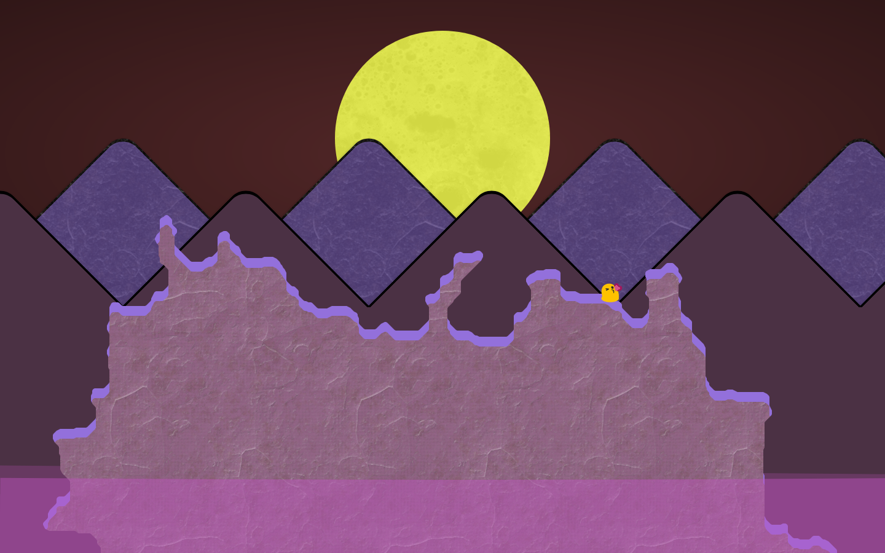
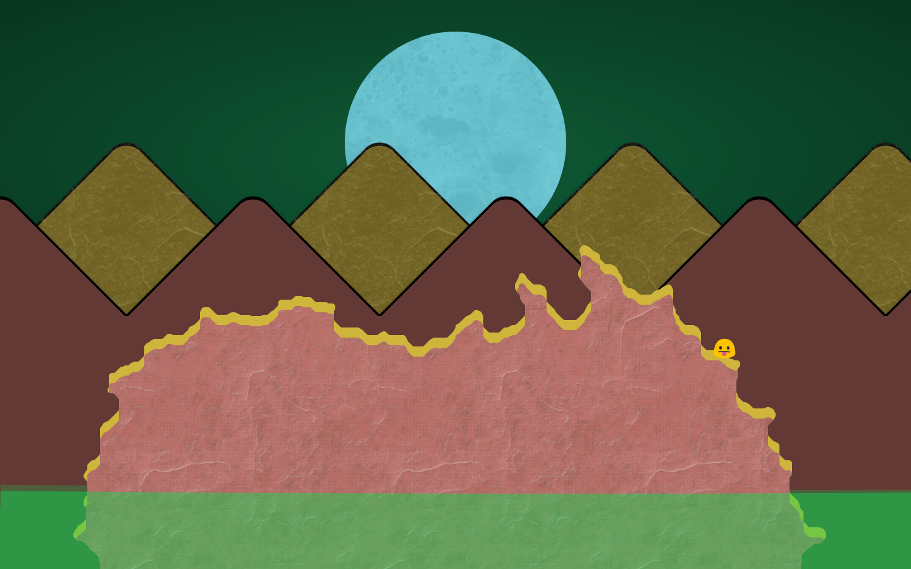

## Interplanetary Surfaces

Todo:

* 4 layers of parrallax (moon, mountains X 2, island) based on cursor
* Create wrapper functions for "generating" planet surfaces
* Create wrapper functions for "fetching" stored planet surfaces
* Full screen loading until planet surface fully loaded
* Alternative "can't find landing area" for any failures
* Use specific configuration settings based on URL ?coords=1,2,3
* Replace use of random seed to seed from configuration
* Never generate or show a surface unless matching configuration found
* Introduce animated speech bubble "function" for game narrative
* Introduce full mobile, tablet, desktop responsiveness ...
* __Only then can we look at smart contracts__

Nice to have:

* Different background types
* Setting suns and rising moons based on time of day
* Introducing day and night cycles / background types
* One surface screen per hex tile of planet
* Surface properties match planet hex location
* Ability to move characters around the landscape

Existing examples:

### Uncornia [ 92, 9, 10 ]

### Smallville [ 5, 3, 79 ]

